# Dashboard LabControl


## Índice

- [Visão Geral](#visão-geral)
- [Estrutura do Projeto](#estrutura-do-projeto)
- [Tecnologias Utilizadas](#tecnologias-utilizadas)
- [Funcionalidades](#funcionalidades)
- [Arquitetura](#arquitetura)
- [Diagramas](#diagramas)
- [Instalação e Configuração](#instalação-e-configuração)
- [Uso](#uso)
- [API](#api)
- [Contribuição](#contribuição)
- [Licença](#licença)

## Visão Geral

O Dashboard LabControl é um sistema completo para gerenciamento de laboratórios de controle tecnológico de concreto. A plataforma permite o controle de amostras, ensaios, cargas de concreto, clientes, obras e não conformidades, oferecendo uma solução integrada para laboratórios que realizam ensaios de resistência à compressão de corpos de prova de concreto.

O sistema é composto por um backend em Spring Boot e um frontend em React/TypeScript, proporcionando uma experiência de usuário moderna e responsiva, com acesso a dados em tempo real e geração de relatórios detalhados.

## Estrutura do Projeto

O projeto está organizado em dois componentes principais:

### Backend (`/dashboard-backend`)

```
dashboard-backend/
├── src/
│   ├── main/
│   │   ├── java/
│   │   │   └── br/
│   │   │       └── com/
│   │   │           └── dashboard/
│   │   │               ├── config/
│   │   │               ├── controller/
│   │   │               ├── dto/
│   │   │               ├── entity/
│   │   │               ├── enums/
│   │   │               ├── repository/
│   │   │               ├── security/
│   │   │               ├── service/
│   │   │               └── BackendDashboardApplication.java
│   │   └── resources/
│   └── test/
├── .env
├── build.gradle
├── docker-compose.yml
└── docker-compose.prod.yml
```

### Frontend (`/dashboard-frontend`)

```
dashboard-frontend/
├── public/
├── src/
│   ├── components/
│   │   ├── Card/
│   │   └── Sidebar/
│   ├── config/
│   ├── contexts/
│   ├── pages/
│   │   ├── Dashboard/
│   │   └── Login/
│   ├── services/
│   ├── styles/
│   ├── App.tsx
│   └── main.tsx
├── .env
├── package.json
└── vite.config.ts
```

### Diagramas (`/fluxogramas`)

```
fluxogramas/
├── diagrama-fluxo-dados.md
├── diagrama-fluxo-projeto.md
└── diagrama-uml-backend.md
```

## Tecnologias Utilizadas

### Backend
- **Java 17**
- **Spring Boot 3.x**
- **Spring Data JPA**
- **Spring Security**
- **Keycloak** (Autenticação e Autorização)
- **PostgreSQL** (Banco de Dados)
- **Docker & Docker Compose**
- **Gradle**

### Frontend
- **React 18**
- **TypeScript**
- **Vite**
- **Tailwind CSS**
- **React Router**
- **Axios**
- **React Query**

## Funcionalidades

### Gestão de Amostras
- Cadastro e rastreamento de amostras de concreto
- Associação com cargas de concreto e obras
- Visualização do histórico de amostras

### Controle de Cargas de Concreto
- Registro de cargas recebidas
- Controle de notas fiscais
- Monitoramento de tempos de chegada e descarregamento
- Associação com classes de resistência e concreteiras

### Ensaios de Resistência
- Registro de ensaios de compressão
- Controle de idades de rompimento (7, 14, 28 dias)
- Cálculo automático de resultados
- Detecção de não conformidades

### Gestão de Clientes e Obras
- Cadastro de clientes
- Registro de obras
- Associação de responsáveis técnicos
- Histórico de fornecimentos

### Dashboard Analítico
- Visualização de indicadores de desempenho
- Gráficos de evolução de resistência
- Alertas de não conformidades
- Resumo de ensaios pendentes e concluídos

### Relatórios
- Geração de relatórios técnicos
- Exportação em PDF
- Relatórios de não conformidades
- Estatísticas de desempenho

### Gestão de Não Conformidades
- Identificação automática de resultados fora do padrão
- Registro de tratativas
- Acompanhamento de ações corretivas
- Notificações para responsáveis

## Arquitetura

O sistema segue uma arquitetura em camadas, com separação clara de responsabilidades:

### Backend
- **Camada de Controladores**: Endpoints REST para comunicação com o frontend
- **Camada de Serviços**: Lógica de negócio e regras de aplicação
- **Camada de Repositórios**: Acesso a dados e persistência
- **Camada de Entidades**: Modelos de domínio e mapeamento ORM

### Frontend
- **Componentes**: Elementos reutilizáveis da interface
- **Páginas**: Telas principais da aplicação
- **Contextos**: Gerenciamento de estado global
- **Serviços**: Comunicação com a API e lógica de negócio

### Comunicação
- API REST para comunicação entre frontend e backend
- Autenticação baseada em JWT com Keycloak
- Comunicação assíncrona para operações de longa duração

## Diagramas

O projeto inclui diagramas detalhados para visualização da arquitetura e fluxos:

### Fluxograma do Projeto


### Diagrama UML do Backend

```mermaid
classDiagram
    class Amostra {
        - id: Long
        - nome: String
        - descricao: String
        - dataCriacao: Date
    }

    class CargaConcreto {
        - id: Long
        - nome: String
        - descricao: String
        - dataCriacao: Date
    }

    class ClasseResistencia {
        - id: Long
        - nome: String
        - descricao: String
        - dataCriacao: Date
    }

    class Cliente {
        - id: Long
        - nome: String
        - descricao: String
        - dataCriacao: Date
    }

    class Obra {
        - id: Long
        - nome: String
        - descricao: String
        - dataCriacao: Date
    }

    class Ensaio {
        - id: Long
        - nome: String
        - descricao: String
        - dataCriacao: Date
    }

    class AmostraController {
        + criarAmostra(amostra: Amostra): Amostra
        + atualizarAmostra(amostra: Amostra): Amostra
        + deletarAmostra(id: Long): void
    }

    class CargaConcretoController {
        + criarCargaConcreto(cargaConcreto: CargaConcreto): CargaConcreto
        + atualizarCargaConcreto(cargaConcreto: CargaConcreto): CargaConcreto
        + deletarCargaConcreto(id: Long): void
    }

    class ClasseResistenciaController {
        + criarClasseResistencia(classeResistencia: ClasseResistencia): ClasseResistencia
        + atualizarClasseResistencia(classeResistencia: ClasseResistencia): ClasseResistencia
        + deletarClasseResistencia(id: Long): void
    }

    class ClienteController {
        + criarCliente(cliente: Cliente): Cliente
        + atualizarCliente(cliente: Cliente): Cliente
        + deletarCliente(id: Long): void
    }

    class ObraController {
        + criarObra(obra: Obra): Obra
        + atualizarObra(obra: Obra): Obra
        + deletarObra(id: Long): void
    }

    class EnsaioController {
        + criarEnsaio(ensaio: Ensaio): Ensaio
        + atualizarEnsaio(ensaio: Ensaio): Ensaio
        + deletarEnsaio(id: Long): void
    }
```



## Instalação e Configuração

### Pré-requisitos
- Java 17 ou superior
- Node.js 16 ou superior
- Docker e Docker Compose
- PostgreSQL (ou usar a versão containerizada)

### Backend

1. Clone o repositório:
```bash
git clone https://github.com/seu-usuario/dashboard-labcontrol.git
cd dashboard-labcontrol
```

2. Configure o arquivo `.env` na pasta `dashboard-backend`:
```
DB_USERNAME=postgres
DB_PASSWORD=sua_senha
DB_URL=jdbc:postgresql://localhost:5432/labcontrol
KEYCLOAK_URL=http://localhost:8180
```

3. Inicie os containers:
```bash
cd dashboard-backend
docker-compose up -d
```

4. Execute a aplicação:
```bash
./gradlew bootRun
```

### Frontend

1. Navegue até a pasta do frontend:
```bash
cd dashboard-frontend
```

2. Configure o arquivo `.env`:
```
VITE_API_URL=http://localhost:8080/api
VITE_KEYCLOAK_URL=http://localhost:8180
VITE_KEYCLOAK_REALM=labcontrol
VITE_KEYCLOAK_CLIENT_ID=frontend
```

3. Instale as dependências:
```bash
npm install
```

4. Inicie a aplicação:
```bash
npm run dev
```

## Uso

Após a instalação, acesse a aplicação em `http://localhost:5173`. Faça login com as credenciais padrão:

- **Usuário**: admin
- **Senha**: admin123

A partir do dashboard, você terá acesso a todas as funcionalidades do sistema.

## API

A API REST do backend está disponível em `http://localhost:8080/api` e inclui os seguintes endpoints principais:

- `/api/amostras`: Gerenciamento de amostras
- `/api/cargas`: Gerenciamento de cargas de concreto
- `/api/ensaios`: Gerenciamento de ensaios
- `/api/clientes`: Gerenciamento de clientes
- `/api/obras`: Gerenciamento de obras
- `/api/dashboard`: Dados para o dashboard
- `/api/relatorios`: Geração de relatórios
- `/api/nao-conformidades`: Gestão de não conformidades

Para documentação detalhada da API, acesse `http://localhost:8080/swagger-ui.html` após iniciar o backend.

## Contribuição

Contribuições são bem-vindas! Para contribuir:

1. Faça um fork do projeto
2. Crie uma branch para sua feature (`git checkout -b feature/nova-funcionalidade`)
3. Faça commit das suas alterações (`git commit -m 'Adiciona nova funcionalidade'`)
4. Faça push para a branch (`git push origin feature/nova-funcionalidade`)
5. Abra um Pull Request

## Licença

Este projeto está licenciado sob a licença MIT - veja o arquivo LICENSE para detalhes.

---

Desenvolvido com ❤️ pela equipe LabControl
