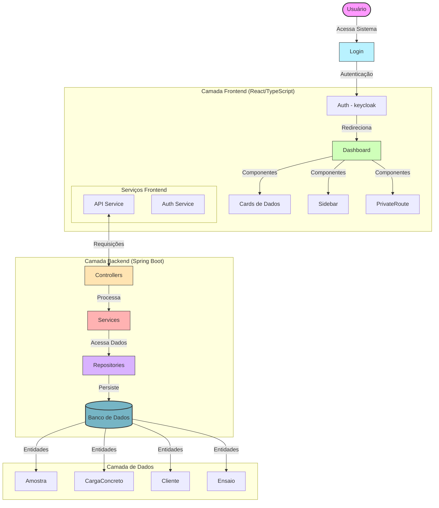

# Diagrama de Fluxo de Dados do Dashboard-LabControl

## Descrição do Fluxo de Dados

Este diagrama representa o fluxo de dados completo do sistema Dashboard-LabControl, desde a interação do usuário com o frontend até o processamento no backend e persistência no banco de dados.

### Fluxo Principal:

1. **Autenticação**
   - Usuários (clientes ou administradores) acessam o sistema via tela de login
   - O processo de autenticação gera um token que permite acesso ao Dashboard

2. **Dashboard e Operações**
   - A partir do Dashboard, usuários podem navegar para diferentes formulários:
     - Cadastro de Amostras
     - Registro de Cargas de Concreto
     - Registro de Ensaios
     - Visualização de Relatórios

3. **Processamento Backend**
   - Cada formulário interage com um processo específico no backend:
     - Processamento de Amostras: gerencia o ciclo de vida das amostras
     - Processamento de Cargas: controla entradas de cargas de concreto
     - Processamento de Ensaios: registra resultados de testes
     - Processamento de Dashboard: gera estatísticas e métricas
     - Geração de Relatórios: cria relatórios formatados

4. **Validação e Qualidade**
   - Resultados de ensaios passam por validação
   - Detecção de anomalias identifica possíveis não conformidades
   - Sistema de notificações alerta usuários sobre problemas

5. **Persistência**
   - Todos os dados são armazenados no banco de dados relacional
   - Operações CRUD são realizadas através dos repositórios

Este fluxo de dados demonstra como o sistema integra os processos de controle laboratorial de concreto, desde a coleta de amostras até a análise de resultados e geração de relatórios.
