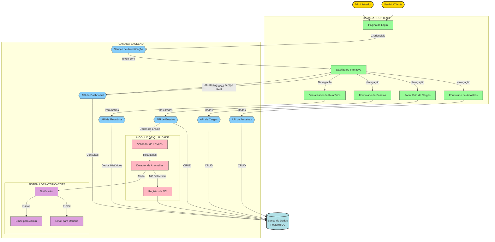

# Fluxograma do Projeto Dashboard-LabControl

## Fluxo Principal do Sistema

1. O usuário acessa o sistema através da interface de login
2. Após autenticação, o usuário é redirecionado para o Dashboard
3. No Dashboard, o usuário pode:
   - Visualizar dados analíticos sobre ensaios de concreto
   - Gerenciar amostras
   - Gerenciar cargas de concreto
   - Gerenciar obras e clientes
   - Visualizar e tratar não conformidades
   - Gerar relatórios

4. Todos os dados são persistidos no banco de dados através da API REST
5. A segurança é gerenciada através de autenticação/autorização
